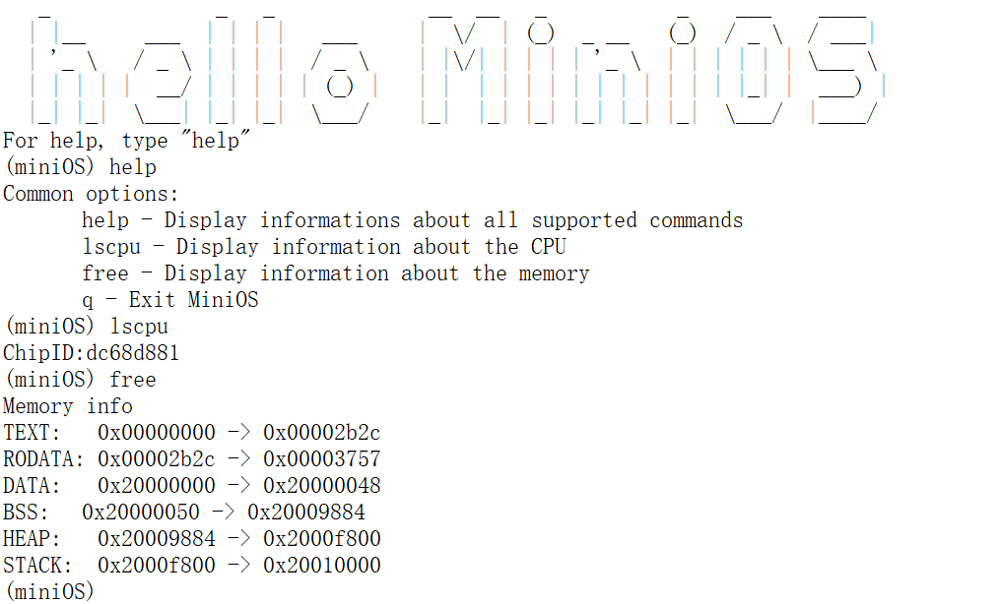

# MiniOS

## 简介

MiniOS 是一个基于 RISC-V 架构的简易实时操作系统。

## Quick Start

1. 安装依赖

请确保安装好 riscv-roolchain (编译需要) 和 openocd (烧写和Debug需要)，并添加到系统路径

2. 编译 miniOS

执行以下命令后可以见到 `build` 目录下生成 `miniOS.bin` 可执行文件。
```bash
mkdir build && cd build
cmake ..
make
```

3. 烧写到CH32V307

```bash
cd build
make flash
```

*Now, Enjoy it!*



## Features List
- 支持动态内存管理
- 支持上下文切换和多任务
- 支持异常与中断处理
- 支持简易系统调用

### Application (TBC)

- minishell
- flybird
- miniplayer
- minislide

## 参考文档

- [CH32FV2x_V3xRM.PDF](doc/CH32FV2x_V3xRM.PDF)
- [CH32V307DS0.PDF](doc/CH32V307DS0.PDF)

## 已知问题

- 当进入while后使用中断会直接halt
- 理论上shell的输入应该由keyboard的中断来触发，而不是uart2的中断，但目前没有keyboard进行实验，所以使用uart2的中断来触发shell的输入。
